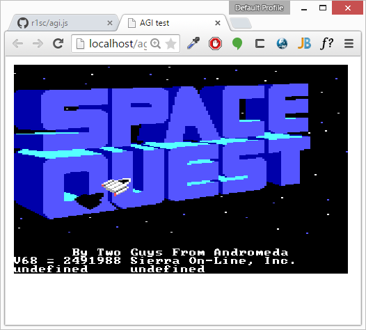
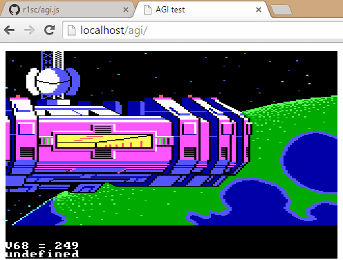
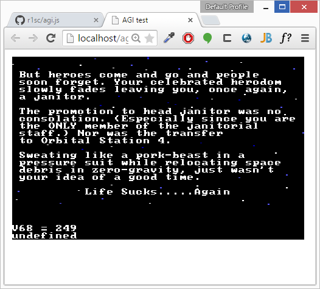

# agi.js
Adventure Game Interpreter for Sierra's classic 80's adventure games written in TypeScript.

## Background

This is a project that aims to recreate one of the most beautiful game engines ever created.
Sierra On-Line's Adventure Game Interpreter was created in the mid 80's by Sierra employees 
Jeff Stephenson and Chris Iden and quickly became the cornerstone on which many of Sierra's 
early titles would be based. AGI was built around the concept of a virtual machine that made 
it fairly easy for Sierra to port their games to multiple platforms.

The virtual machine was based around an in-house developed C-like programming language called "Logic".
When the programmer compiled a Logic file, the compiler produced an 8-bit "opcode" for each statement.
In the interpreter, each opcode was defined in a jump table which simply pointed to an assembler
subroutine. This made the system very fast and ridiculously elegant, because the logic itself never
needed to be recompiled no matter what the target platform was. It was also fairly easy to extend
the system which can be witnessed by the numerous versions of AGI interpreters produced by Sierra.

By the time these games were created, storage was limited and expensive. To reduce asset size,
the game's background images were defined as vector graphics instead of full raster images. 
When the game needed to display a new background image, it was drawn into a buffer and 
finally blitted to the screen. This is interesting because this theoretically allows us to rescale 
the images to any resolution. It's also interesting from an artistic perspective as it allows us to 
trace how the artist originally drawed the pictures, command by command. 

Another interesting feature of the engine was its ability render a room with a pseudo-perspective.
The engine divided the screen into 15 sections, called priority bands. This was basically a
kind of low-resolution Z-buffer. All background drawing commands were drawn both with a visual color
and a priority value, so everytime the engine had to draw an animated object, each of its pixels were
compared against the backgrounds pixel's priority value to decide if the pixel was to be drawn or not.
All control-lines and boundaries where the player could not go was also drawn into this priority buffer.

## Implementation

Most of the code has been "clean room" implemented from the specs defined by Lance Ewing, Peter Kelly, 
Claudio Matsuoka, Stu George and David Symonds at http://wiki.scummvm.org/index.php/AGI/Specifications.
Some parts of the PIC rendering code was borrowed from Lance Ewing's "SHOWPIC" program.

This TypeScript implementation parses the original asset files without any precompilation of any sort.
The system is divided into a renderer, a logic parser, an interpreter and a resource manager. 
The resource manager is mostly complete, save for a few assets that hasn't been taken into consideration 
yet (sounds, dictionary etc.).

The logic parser seems to be working well acording to my tests. The system mainly needs work on the 
interpreter; the main issue being that some details are missing from the specs defined above and need
slight reverse engineering.

## Contribution

**Please fork and contribute!** If you make anything useful, please provide a pull request so I can integrate
your work into the main repo.

## License

Licensed under the GPL version 3. 

This is in no way affiliated with or endorsed by Sierra Entertainment or any other company.
